# Nexus Ecosystem — Navigation Sitemap

A unified navigation system across the entire enterprise HRMS + social
platform. Vanilla HTML / CSS / JS, no build step, mobile-first responsive.

---

## 1. Navigation Hierarchy

```
Landing Page                   (platform_landing_page/code.html)
│
├── Sign In                    (login_employee_ecosystem/code.html)
│   ├── Create Account         (create_enterprise_account/code.html)
│   └── Two‑Factor Auth        (two_factor_authentication/code.html)
│
└── Welcome, Alex              (nexus_enterprise/code.html)            ← role selector
    │
    ├── Employee Dashboard     (personal_employee_dashboard/code.html)
    │   ├── Messages           (enterprise_messaging_chat/code.html)
    │   ├── Communities        (communities_groups_hub/code.html)
    │   ├── Company Feed       (company_news_feed/code.html)
    │   ├── Reels              (social_news_feed_stories/code.html)
    │   ├── Performance Goals  (performance_review_center/code.html)
    │   ├── Payroll & Benefits (payroll_benefits/code.html)
    │   └── Projects Board     (project_kanban_board/code.html)
    │
    ├── HR Dashboard           (hr_administration_dashboard/code.html)
    │   ├── Recruitment Hub        (recruitment_pipeline_dashboard/code.html)
    │   ├── Approvals & Workflows  (employee_onboarding_workflow/code.html)
    │   ├── Employee Ecosystem     (employee_social_profile/code.html)
    │   └── Org Structure          (organizational_hierarchy_chart/code.html)
    │
    ├── Executive Dashboard    (executive_dashboard/code.html)
    │   ├── AI Analytics       (ai_intelligence_hub/code.html)
    │   ├── Company Feed       (company_news_feed/code.html)
    │   └── Org Structure      (organizational_hierarchy_chart/code.html)
    │
    └── Admin Dashboard        (managerial_insights_dashboard/code.html)
        ├── AI Analytics       (ai_intelligence_hub/code.html)
        ├── Employee Ecosystem (employee_social_profile/code.html)
        ├── Recruitment Hub    (recruitment_pipeline_dashboard/code.html)
        ├── Approvals & Workflows (employee_onboarding_workflow/code.html)
        └── Org Structure      (organizational_hierarchy_chart/code.html)
```

---

## 2. Mermaid Diagram

```mermaid
flowchart TD
    A([Landing Page]):::pub --> B([Sign In]):::pub
    B --> B1([Create Account]):::pub
    B --> B2([Two-Factor Auth]):::pub
    B --> W([Welcome, Alex]):::hub

    W --> ED([Employee Dashboard]):::role
    W --> HD([HR Dashboard]):::role
    W --> XD([Executive Dashboard]):::role
    W --> AD([Admin Dashboard]):::role

    ED --> MSG([Messages])
    ED --> COM([Communities])
    ED --> CF1([Company Feed])
    ED --> REE([Reels])
    ED --> PER([Performance Goals])
    ED --> PAY([Payroll & Benefits])
    ED --> KAN([Projects Board])

    HD --> REC1([Recruitment Hub])
    HD --> APP1([Approvals & Workflows])
    HD --> EE1([Employee Ecosystem])
    HD --> OS1([Org Structure])

    XD --> AI1([AI Analytics])
    XD --> CF2([Company Feed])
    XD --> OS2([Org Structure])

    AD --> AI2([AI Analytics])
    AD --> EE2([Employee Ecosystem])
    AD --> REC2([Recruitment Hub])
    AD --> APP2([Approvals & Workflows])
    AD --> OS3([Org Structure])

    classDef pub  fill:#e1e8ff,stroke:#003d9b,color:#003d9b;
    classDef hub  fill:#d4e0f8,stroke:#003d9b,color:#003d9b,stroke-width:2px;
    classDef role fill:#e5deff,stroke:#432f9c,color:#432f9c,stroke-width:2px;
```



---

## 3. Shell Modes

| Shell     | Used by                                                       | Layout                                    |
|-----------|---------------------------------------------------------------|-------------------------------------------|
| `public`  | Landing, Sign In, Create Account, Two-Factor Auth             | Slim glass top-bar + brand CTA            |
| `app`     | Welcome, all four dashboards and every sub-module             | Sidebar + Top navbar + Breadcrumbs        |

The shell is selected by the `data-shell` attribute on each page's `<body>`.

---

## 4. File / Folder Layout

```
HR-Application/
├── index.html                                  ← root auto-redirect to landing
├── README.md
├── SITEMAP.md
│
├── shared/                                     ← single source of truth for nav
│   ├── nav-data.js     ← module registry, hierarchy, dashboard quicklinks
│   ├── nav.css         ← layout, navbar, sidebar, breadcrumbs, drawer
│   └── nav.js          ← runtime renderer + active state + mobile drawer
│
├── platform_landing_page/code.html             ← Landing      (public)
├── login_employee_ecosystem/code.html          ← Sign In      (public)
├── create_enterprise_account/code.html         ← Register     (public)
├── two_factor_authentication/code.html         ← 2FA          (public)
│
├── nexus_enterprise/code.html                  ← Welcome, Alex (app, role-selector)
│
├── personal_employee_dashboard/code.html       ← Employee Dashboard
├── enterprise_messaging_chat/code.html         ← Messages
├── communities_groups_hub/code.html            ← Communities
├── company_news_feed/code.html                 ← Company Feed
├── social_news_feed_stories/code.html          ← Reels
├── performance_review_center/code.html         ← Performance Goals
├── payroll_benefits/code.html                  ← Payroll & Benefits
├── project_kanban_board/code.html              ← Projects Board
│
├── hr_administration_dashboard/code.html       ← HR Dashboard
├── recruitment_pipeline_dashboard/code.html    ← Recruitment Hub
├── employee_onboarding_workflow/code.html      ← Approvals & Workflows
├── employee_social_profile/code.html           ← Employee Ecosystem
├── organizational_hierarchy_chart/code.html    ← Org Structure
│
├── executive_dashboard/code.html               ← Executive Dashboard
├── managerial_insights_dashboard/code.html     ← Admin Dashboard
└── ai_intelligence_hub/code.html               ← AI Analytics
```

---

## 5. How Each Page is Wired

Every page declares its identity on `<body>`:

```html
<body data-shell="app" data-module="employeeDashboard">
```

…and includes the shared bundle just before `</head>`:

```html
<link rel="stylesheet" href="../shared/nav.css" />
<script src="../shared/nav-data.js" defer></script>
<script src="../shared/nav.js" defer></script>
```

At load time `nav.js`:

1. Reads `data-module` & `data-shell` from `<body>`.
2. Hides any page-local mock `<header>` / `<aside>` (legacy markup).
3. For `data-shell="app"`:
   - Injects the **left sidebar** with branded header, grouped module list,
     active-item highlight, parent-trail highlight, and a sign-out footer.
   - Injects the sticky **top navbar** with hamburger (mobile), brand,
     search field (⌘K), AI assistant, notifications, settings and profile.
   - Injects sticky **breadcrumbs** under the navbar from
     `NEXUS_NAV.trail(currentModuleId)`.
   - Wires the mobile drawer (hamburger, backdrop click, ESC, link-click).
4. For `data-shell="public"`:
   - Injects a slim glass **public top-bar** with brand, primary links and
     an "Enter Workspace" CTA.
5. Renders dashboard quicklink cards inside any `[data-quicklinks="..."]`
   container, e.g.
   ```html
   <div data-quicklinks="employeeDashboard"></div>
   ```
   will be auto-populated with cards for Messages, Communities, Company
   Feed, Reels, Performance Goals and Payroll & Benefits.

---

## 6. Module Registry (nav-data.js)

| moduleId            | folder                              | parent             | sidebar group |
|---------------------|-------------------------------------|--------------------|---------------|
| `landing`           | platform_landing_page               | —                  | — (public)    |
| `signIn`            | login_employee_ecosystem            | `landing`          | — (public)    |
| `createAccount`     | create_enterprise_account           | `signIn`           | — (public)    |
| `twoFactor`         | two_factor_authentication           | `signIn`           | — (public)    |
| `welcome`           | nexus_enterprise                    | `signIn`           | home          |
| `employeeDashboard` | personal_employee_dashboard         | `welcome`          | workspace     |
| `hrDashboard`       | hr_administration_dashboard         | `welcome`          | workspace     |
| `execDashboard`     | executive_dashboard                 | `welcome`          | workspace     |
| `adminDashboard`    | managerial_insights_dashboard       | `welcome`          | workspace     |
| `messages`          | enterprise_messaging_chat           | `employeeDashboard`| employee      |
| `communities`       | communities_groups_hub              | `employeeDashboard`| employee      |
| `companyFeed`       | company_news_feed                   | `employeeDashboard`| employee      |
| `reels`             | social_news_feed_stories            | `employeeDashboard`| employee      |
| `performance`       | performance_review_center           | `employeeDashboard`| employee      |
| `payroll`           | payroll_benefits                    | `employeeDashboard`| employee      |
| `projects`          | project_kanban_board                | `employeeDashboard`| employee      |
| `recruitment`       | recruitment_pipeline_dashboard      | `hrDashboard`      | people        |
| `approvals`         | employee_onboarding_workflow        | `hrDashboard`      | people        |
| `employeeEcosystem` | employee_social_profile             | `hrDashboard`      | people        |
| `orgStructure`      | organizational_hierarchy_chart      | `hrDashboard`      | people        |
| `aiAnalytics`       | ai_intelligence_hub                 | `execDashboard`    | insights      |

To add a new module: append an entry in `shared/nav-data.js`, list it in
the appropriate `navGroups` entry, and add `data-shell="app" data-module="<id>"`
to its page `<body>`. No other page needs to be touched.

---

## 7. Responsive Behavior

| Viewport     | Sidebar                         | Navbar search | Breadcrumbs    |
|--------------|---------------------------------|---------------|----------------|
| ≥ 1024 px    | Fixed 280 px, user-meta visible | Full width    | Full           |
| 768–1023 px  | Fixed 280 px                    | Compact       | Full           |
| < 768 px     | Off-canvas drawer + backdrop    | Compact       | Wraps to 2 lines |

Keyboard shortcuts: **Esc** closes the drawer, **⌘/Ctrl + K** focuses the
global search field.

---

## 8. UX Best Practices Applied

- **Single source of truth** — every link, label and parent relationship is
  defined once in `nav-data.js`; pages never hard-code other pages.
- **Active-state clarity** — the current page is highlighted in the
  sidebar (gradient pill + indicator bar) *and* shown as the bold last
  segment in breadcrumbs (`aria-current="page"`).
- **Parent trail** — every ancestor module in the active trail receives a
  soft accent so users always see where they sit in the hierarchy.
- **Glassmorphism shell** — navbar/sidebar use translucency + backdrop
  blur, so the rich page content shows through subtly, signalling a
  layered architecture without heavy borders.
- **Mobile drawer with backdrop** — on small screens the sidebar slides
  in, body scroll locks, ESC closes, and tapping a link auto-dismisses.
- **Accessible focus states** — keyboard users get a 2 px primary outline
  on every interactive element in the shell.
- **Reduced motion** — all transitions are disabled under
  `prefers-reduced-motion: reduce`.
- **No CSS-class clashes** — every shared class is namespaced `nx-*` so
  it never collides with the Tailwind utilities used by individual
  module pages.
- **Progressive enhancement** — if JavaScript fails to load the underlying
  page content is still readable (the shell just doesn't render).
