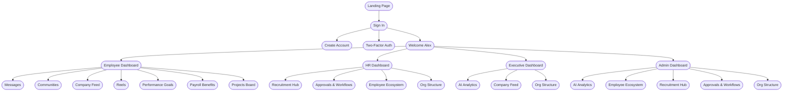

# Nexus Ecosystem — Navigation Sitemap

A unified navigation tree across the enterprise HRMS + social platform.

## Navigation Hierarchy

```
Landing Page  (platform_landing_page/code.html)
│
├── Sign In  (login_employee_ecosystem/code.html)
│   ├── Create Account  (create_enterprise_account/code.html)
│   └── Two‑Factor Auth (two_factor_authentication/code.html)
│
└── Welcome Alex  (nexus_enterprise/code.html)               [role selector]
    │
    ├── Employee Dashboard  (personal_employee_dashboard/code.html)
    │   ├── Messages           (enterprise_messaging_chat/code.html)
    │   ├── Communities        (communities_groups_hub/code.html)
    │   ├── Company Feed       (company_news_feed/code.html)
    │   ├── Reels              (social_news_feed_stories/code.html)
    │   ├── Performance Goals  (performance_review_center/code.html)
    │   ├── Payroll Benefits   (payroll_benefits/code.html)
    │   └── Projects Board     (project_kanban_board/code.html)
    │
    ├── HR Dashboard  (hr_administration_dashboard/code.html)
    │   ├── Recruitment Hub        (recruitment_pipeline_dashboard/code.html)
    │   ├── Approvals & Workflows  (employee_onboarding_workflow/code.html)
    │   ├── Employee Ecosystem     (employee_social_profile/code.html)
    │   └── Org Structure          (organizational_hierarchy_chart/code.html)
    │
    ├── Executive Dashboard  (executive_dashboard/code.html)
    │   ├── AI Analytics Dashboard (ai_intelligence_hub/code.html)
    │   ├── Company Feed           (company_news_feed/code.html)
    │   └── Org Structure          (organizational_hierarchy_chart/code.html)
    │
    └── Admin Dashboard  (managerial_insights_dashboard/code.html)
        ├── AI Analytics Dashboard (ai_intelligence_hub/code.html)
        ├── Employee Ecosystem     (employee_social_profile/code.html)
        ├── Recruitment Hub        (recruitment_pipeline_dashboard/code.html)
        ├── Approvals & Workflows  (employee_onboarding_workflow/code.html)
        └── Org Structure          (organizational_hierarchy_chart/code.html)
```

## Mermaid Diagram



## Shell Modes

| Shell | Used by | Layout |
|-------|---------|--------|
| `public`  | Landing, Sign In, Create Account, 2FA | Slim top‑nav only |
| `app`     | All authenticated dashboards & sub‑pages | Sidebar + Top navbar + Breadcrumbs |

## File / Folder Layout

```
stitch_employee_ecosystem_platform/
├── index.html                          [auto-redirect to landing]
├── SITEMAP.md
├── shared/
│   ├── nav.css                         [layout, sidebar, navbar, breadcrumbs, responsive]
│   ├── nav-data.js                     [module registry + hierarchy]
│   └── nav.js                          [runtime renderer + active state + mobile drawer]
├── platform_landing_page/code.html
├── login_employee_ecosystem/code.html
├── create_enterprise_account/code.html
├── two_factor_authentication/code.html
├── nexus_enterprise/code.html          [Welcome Alex — NEW]
├── personal_employee_dashboard/code.html
├── enterprise_messaging_chat/code.html
├── communities_groups_hub/code.html
├── company_news_feed/code.html
├── social_news_feed_stories/code.html
├── performance_review_center/code.html
├── payroll_benefits/code.html          [Payroll & Benefits — NEW]
├── project_kanban_board/code.html
├── hr_administration_dashboard/code.html
├── recruitment_pipeline_dashboard/code.html
├── employee_onboarding_workflow/code.html
├── employee_social_profile/code.html
├── organizational_hierarchy_chart/code.html
├── executive_dashboard/code.html
├── managerial_insights_dashboard/code.html
└── ai_intelligence_hub/code.html
```

## How Each Page is Wired

Every page declares its identity on `<body>`:

```html
<body data-shell="app" data-module="employeeDashboard">
```

…and includes the shared bundle:

```html
<link rel="stylesheet" href="../shared/nav.css" />
<script src="../shared/nav-data.js" defer></script>
<script src="../shared/nav.js" defer></script>
```

At load time `nav.js`:
1. Reads `data-module` & `data-shell`.
2. Removes any page-local `<header>` / `<aside>` mock.
3. Injects the top **navbar** (search, notifications, profile).
4. Injects the left **sidebar** with the active item highlighted and the parent group expanded.
5. Injects **breadcrumbs** above the main content from the module's parent chain.
6. Wires the mobile drawer toggle and Esc-to-close.
